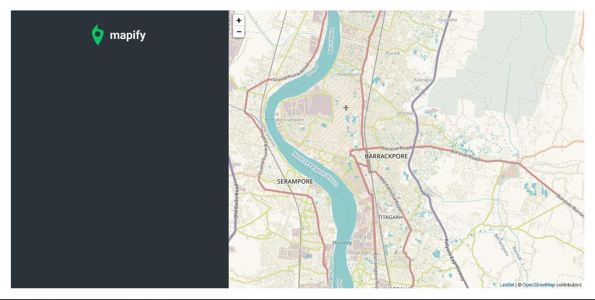

# Mapify

## 

**Mapify** is a web application that simplifies location sharing and exploration. With Mapify, you can effortlessly share your location with friends or find locations shared by others. Whether you're planning a meetup or want to discover interesting places, Mapify has got you covered.

## Table of Contents

- [**Features**](#features)
- [**Demo**](#demo)
- [**Installation**](#installation)
- [**Usage**](#usage)
- [**Contributing**](#contributing)
- [**License**](#license)

## Features

- **Location Sharing**: Easily share your current location with others.
- **Location Discovery**: Discover locations shared by friends and contacts.
- **User-Friendly Interface**: Simple and intuitive design for seamless navigation.
- **Mobile-Responsive**: Access Mapify on the go, from any device.

## Demo

Check out our live demo: [Mapify Demo](https://aditya-ghosh-27.github.io/Mapify/)



## Installation

Follow these steps to install Mapify on your local machine:

1. Clone this repository:
   ```shell
   git clone https://github.com/Aditya-Ghosh-27/Mapify.git
   ```

2. Change to the project directory:
   ```shell
   cd Mapify
   ```

3. Install dependencies using npm or yarn:
   ```shell
   npm install
   # or
   yarn install
   ```

4. Start the development server:
   ```shell
   npm start
   # or
   yarn start
   ```

Mapify should now be running on `http://localhost:3000`.

## Usage

1. Start Mapify by following the installation instructions.
2. Create a new map or open an existing one.
3. Use the intuitive interface to add markers, routes, and other map elements.
4. Customize map styles and layers as needed.
5. Save and export your map for sharing or embedding.

For more detailed usage instructions, refer to our [User Guide](/docs/user-guide.md).

## Contributing

We welcome contributions from the open-source community to make Mapify even better. To get started, follow these steps:

1. Fork the repository.
2. Create a new branch for your feature or bug fix: `git checkout -b feature/your-feature-name`.
3. Make your changes and commit them: `git commit -m "Add your feature"`.
4. Push your changes to your fork: `git push origin feature/your-feature-name`.
5. Open a pull request to this repository.

Please review our [Contribution Guidelines](/CONTRIBUTING.md) for more details.

## License

Mapify is licensed under the MIT License. See the [LICENSE](/LICENSE) file for details.

---

If you have any questions or encounter issues, please [create an issue](https://github.com/Aditya-Ghosh-27/Mapify/issues). We appreciate your feedback and contributions!
